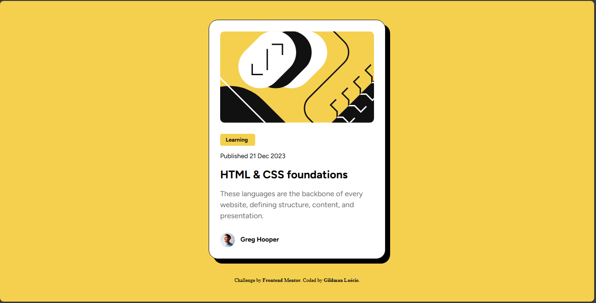

# Frontend Mentor - QR code component solution

This is a solution to the [QR code component challenge on Frontend Mentor](https://www.frontendmentor.io/learning-paths/getting-started-on-frontend-mentor-XJhRWRREZd/steps/66ffdb3f5832c087f25bf3e4/challenge/start). Frontend Mentor challenges help you improve your coding skills by building realistic projects. 

## Table of contents

- [Overview](#overview)
  - [Screenshot](#screenshot)
  - [Links](#links)
- [My process](#my-process)
  - [Built with](#built-with)
  - [What I learned](#what-i-learned)
  - [Continued development](#continued-development)
- [Author](#author)

## Overview

### Screenshot



This is my screenshot showing how the project turned out. 

### Links

- Solution URL: [My Solution](https://github.com/gillaercio/blog-preview-card-main)

## My process

### Built with

- Semantic HTML5 markup
- CSS custom properties
- Flexbox
- Mobile-first workflow
- Using Figma

### What I learned

I took advantage of this project to practice the use of variables in CSS, which standardize and facilitate project maintenance.

A code snippet below:

```css
:root {
  --yellow: hsl(47, 88%, 63%);
  --white: hsl(0, 0%, 100%);
  --gray-500: hsl(0, 0%, 42%);
  --gray-950: hsl(0, 0%, 7%);

  --font-family: 'Figtree', Arial, Helvetica, sans-serif;
  --text-preset: bolder 2em/150% var(--font-family);
  --text-preset2: 1.6em/150% var(--font-family);
}
```

### Continued development

I would like to improve the use of **Flexbox** and further improve the dynamics of using **Figma**

## Author

- Frontend Mentor - [@gillaercio](https://www.frontendmentor.io/profile/gillaercio)
- Github - [My Github](https://github.com/gillaercio)
- LinkedIn - [My LinkedIn](https://www.linkedin.com/in/gildman-la%C3%A9rcio/)

